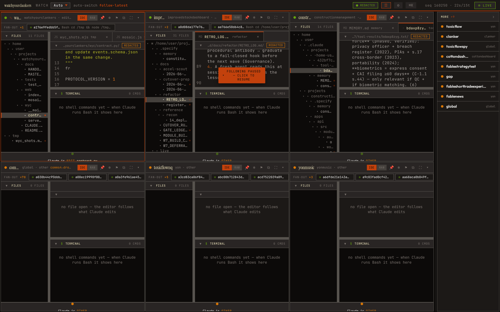
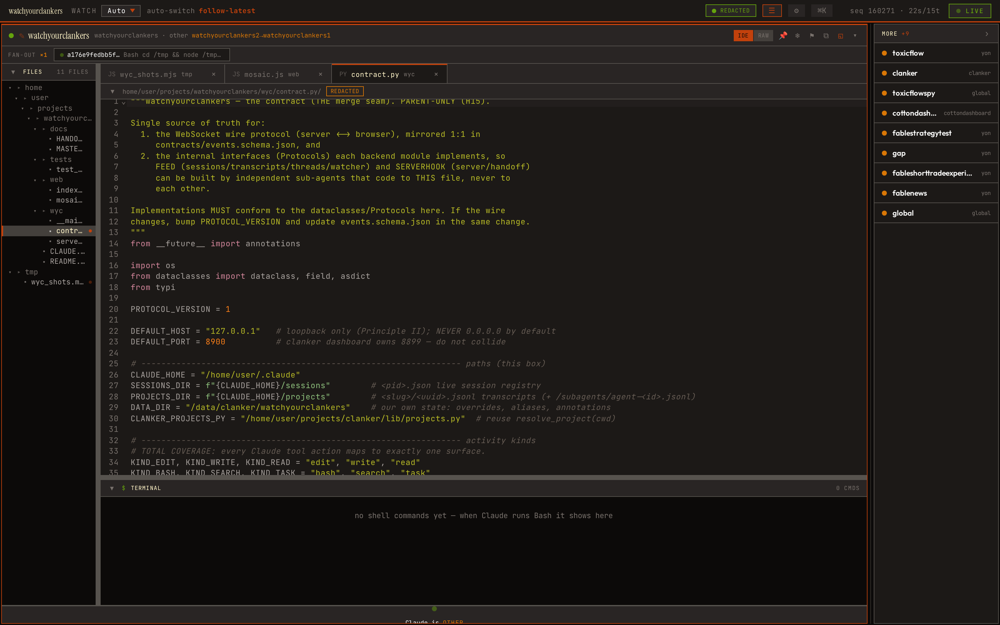

# watchyourclankers

> Watch Claude Code work **live, over its shoulder, in an IDE** — across every session on your machine.

A read-only **IDE-spectator** web UI. As Claude edits files, runs shell commands, peeks at files, searches, and fans out to sub-agents, you see it happen in real time: the editor auto-follows whatever file Claude is editing, the terminal streams the commands it runs, and every other action surfaces on an activity ticker. You are the third person looking over its shoulder.

It **observes; it never acts.** Nothing it does can touch the work it watches — no writes to any transcript, session, or working tree. Built in [clanker](#merges-into-clanker)'s idiom so it can fold into clanker later.

## Screenshots

These are watchyourclankers **spectating its own development** — captured live from the running daemon while this very repo was being worked on.

The multi-session mosaic — every live Claude session on the box tiles into one view, each with its own file tree, auto-following editor, and terminal:



A single session maximized to a full IDE pane — here the editor is open on `wyc/contract.py` (the file being edited in this session), the file tree on the left, the terminal surface below:



## How it works

watchyourclankers turns the raw firehose of Claude Code activity into the experience of **standing behind a developer in their IDE** — the editor tabs to whatever file Claude opens, the terminal shows each `Bash` command the instant it fires, and file-peeks, greps/globs, `TodoWrite`s, web fetches, and sub-agent fan-outs all light up as they happen. Many sessions tile into a dynamic mosaic; on a phone it collapses to a swipeable single pane.

It learns what Claude is doing from **three detection sources**, with no cooperation required from the observed sessions:

- **Transcript-tail** — append-safe tailing of `~/.claude/projects/**/*.jsonl` (and the `subagents/agent-*.jsonl` fan-out), plus a poll of the live session registry. This is the canonical feed.
- **tmux** — session identity, liveness, and an optional raw terminal-screen capture.
- **Jailed disk reads** — when the editor needs a file's content, the server reads it directly, but only under an allowlisted root (default `/home/user`, resolved by realpath so symlinks can't escape).

A unit of work is a **thread**, not a session: sessions you leapfrog through handoffs are stitched back into one continuous story.

Two invariants hold the whole thing together:

- **Secrets never reach the glass.** Every value bound for the browser — transcript text, terminal output, file content — passes through `wyc.redact` first.
- **The contract is the seam.** `contracts/events.schema.json` + `wyc/contract.py` define the wire protocol and the internal interfaces; everything codes to them. The server speaks **snapshot-then-stream** over a WebSocket (`/ws`): a hydrating snapshot, then a live stream of redacted events.

The daemon binds **loopback only** and requires a local token (it never serves `0.0.0.0` by default).

```
  ~/.claude/sessions/*.json        ─┐  (live session registry, polled)
  ~/.claude/projects/**/*.jsonl     ├─►  wyc.watcher  ──redact──►  aiohttp /ws  ──►  browser
    + .../subagents/agent-*.jsonl   ┘   poll + tail + stitch       snapshot-          vanilla JS
  tmux (identity + raw screen)     ─────────┘                      then-stream        + CodeMirror 6
```

## Setup

**Requirements**

- **Python 3** with **`aiohttp`** — that's the entire runtime dependency for the server.
- **`node`** is *optional*. You only need it to run the behavioral tests (`node --test`) or to rebuild the vendored CodeMirror bundle. CodeMirror 6 is already vendored on-box at `web/vendor/codemirror.bundle.js`, so the UI needs **no CDN and no build step** to run.

**Install & run**

```bash
git clone https://github.com/CapitalistCookie/watchyourclankers
cd watchyourclankers
python3 -u -m wyc serve
```

On start the daemon prints the URL with the token baked in, e.g.:

```
[wyc] watching — http://127.0.0.1:8900/?token=<token>
[wyc] token file: /data/clanker/watchyourclankers/.wyc_token
```

Open that URL in a browser. The daemon binds **loopback only** (`127.0.0.1:8900`) and every route except `/healthz` requires the token — append `?token=<token>` to the URL. The token is generated on first run and stored (mode `0600`) at:

```
/data/clanker/watchyourclankers/.wyc_token
```

so you can always read it back with `cat /data/clanker/watchyourclankers/.wyc_token`. (`/data/clanker/watchyourclankers/` is also where watchyourclankers keeps its *own* state — thread overrides, aliases, annotations; the observed `~/.claude` artifacts are never written.)

**Options**

- `--host` / `--port` (or `WYC_HOST` / `WYC_PORT`) override the bind address. The default is *always* loopback — don't expose it on `0.0.0.0` without putting it behind your own auth.
- `WYC_FILE_ROOTS` (colon-separated) overrides the allowlisted roots the editor may read files from (default `/home/user`).

There's also a handoff helper that prints a fresh-session continuation one-liner for a thread (reads the running daemon's last snapshot):

```bash
python3 -u -m wyc handoff <thread_id>
```

## Development

The pre-push gate is **`ci/fast.sh`** — it runs the full check ladder (Python import/lint, the pytest suite, frontend syntax + behavioral tests, render smoke, the live DOM-interaction probe, and the framework meta-gates) and prints the literal success token only when every check passed:

```bash
ci/fast.sh        # prints `[ci-fast] ALL GREEN` only if everything passed
```

The frontend's pure-logic modules are covered by behavioral tests (these are what `node` is for):

```bash
node --test web/*.test.mjs
```

Rebuild the vendored CodeMirror bundle only if you bump CodeMirror versions:

```bash
cd build/codemirror && npm ci && npm run build   # → emits web/vendor/codemirror.bundle.js
```

(`node_modules` is gitignored; the committed bundle is the artifact.)

## Architecture

Three layers, with the contract as the seam between them:

- **Feed** — `sessions.py` (live registry poll) + `transcripts.py` (append-safe tail + parse, sub-agents included) + `tmux.py` (tmux identity, liveness, raw screen) + `threads.py` (handoff-spanning stitch) + `watcher.py` (orchestrate everything into one monotonic, redacted event stream).
- **Serve** — `server.py` (aiohttp WebSocket + static, **loopback bind + token auth**) + `handoff.py` (the one-liner generator) + `hooks/post-tool-use.py` (optional enrichment; the daemon degrades gracefully without it) + `redact.py` (every wire-bound value passes through here).
- **Web** — `client.js` / `store.js` (WS client, snapshot-then-stream, `seq`-gap → `resync`), `ide.js` (the IDE-spectator pane, with the vendored CodeMirror editor), `mosaic.js` + `menu.js` (tiling + `Cmd-K` command menu + settings), `app.js` / `index.html` (the shell).

Read-only now. `pin` / `freeze-for-comment` / `flag` exist in the UI but are **read-only stubs** for a later interactive phase — toggling them records intent to watchyourclankers' own store and never touches the observed artifacts.

### Repo layout

```
.specify/               Spec Kit: constitution (binding law), templates, scripts
  memory/constitution.md   Principles I–XI — read this first
contracts/
  events.schema.json    the wire protocol (JSON Schema) — SSOT, mirrored in wyc/contract.py
wyc/                     the Python package (feed + serve + redact + the contract)
  contract.py              dataclasses + Protocols — the merge seam (parent-only)
  redact.py                secret scrubbing — every value to the glass passes through here
hooks/
  post-tool-use.py      optional enrichment hook
web/                     vanilla JS frontend; CodeMirror 6 vendored at web/vendor/
build/codemirror/       the one-time esbuild recipe for the vendored CodeMirror bundle
ci/
  fast.sh               the local pre-push gate (<60s, iron-law success token)
  full.sh               the detached post-commit suite (incl. browser render/CM smoke)
docs/
  MASTER_PLAN.md        vision, the 3-wave plan, decisions (D-log), open issues
  MODULE_BUILD_CHECKLIST.md   H-gates + anti-patterns + the recursive build cycle
specs/NNN-*/            per-feature specs (spec → plan → tasks)
tests/                  pytest suite (contract parity, redaction, stitching, …)
```

## Merges into clanker

watchyourclankers is deliberately built to fold into [clanker](https://github.com/CapitalistCookie/clankers) — the meta harness — rather than stand apart. Both are Python + aiohttp + JSONL with an SSOT under `/data/clanker/`. The merge path: host the `/ws` + static under clanker's `serve.py`; write our state under `/data/clanker/watchyourclankers/`; reuse clanker's `resolve_project(cwd)` for project identity and its HMAC+TOTP auth in place of the standalone token; and optionally feed the live terminal surface from clanker's existing tmux PTY capture. Until then it runs standalone on loopback.

## Read first

- **[`.specify/memory/constitution.md`](.specify/memory/constitution.md)** — the binding law (Principles I–XI: observer-never-actor, secrets-never-reach-the-glass, contract-is-the-seam, …).
- **[`docs/MASTER_PLAN.md`](docs/MASTER_PLAN.md)** — the vision, the 3-wave plan, and the decision log.
- **[`docs/MODULE_BUILD_CHECKLIST.md`](docs/MODULE_BUILD_CHECKLIST.md)** — how work gets built and closed here.

## License

MIT.
